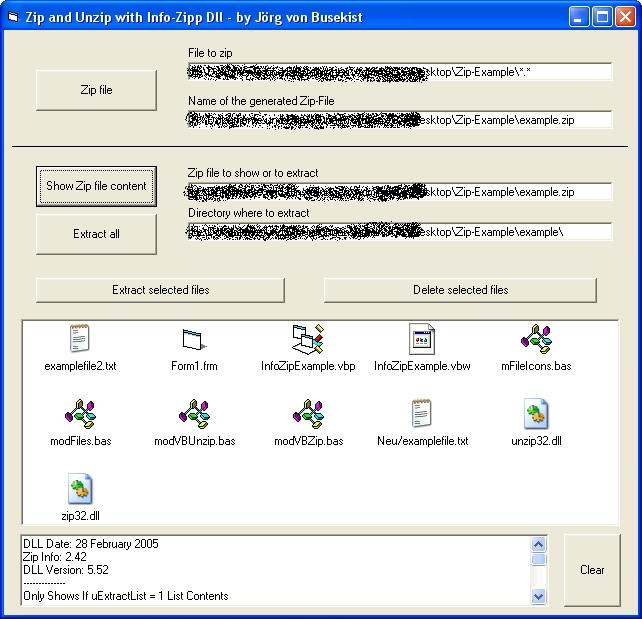



## Zipping with Info\-Zip

### Description

This is an easy to understand example how to use the great Info-Zip Dlls (www.info-zip.org) to zip or unzip files or directories. The basics of this code, the included wrappers, are not by myself and will be supplied automatically if you download the Dlls from info-zip.org. But I have to work a lot to understand how to use the Dlls in my own manner.

This code shows simple to use zip routines: zip a file or directory, unzip a file or directory, unzip a single file of a zip file, delete a single file of a zip file, show the file names inside a zip file. Please vote.

----

Update 08/17/2008: Fixing some severe bugs in the unzip routines.
 
### More Info
 

             |
---                |---
**Submitted On**   |2008-08-15 17:41:28
**By**             |[Jox](https://github.com/Planet-Source-Code/PSCIndex/blob/master/ByAuthor/jox.md)
**Level**          |Intermediate
**User Rating**    |5.0 (15 globes from 3 users)
**Compatibility**  |VB 6\.0
**Category**       |[Files/ File Controls/ Input/ Output](https://github.com/Planet-Source-Code/PSCIndex/blob/master/ByCategory/files-file-controls-input-output__1-3.md)
**World**          |[Visual Basic](https://github.com/Planet-Source-Code/PSCIndex/blob/master/ByWorld/visual-basic.md)
**Archive File**   |[Zipping\_wi2123818172008\.zip](https://github.com/Planet-Source-Code/jox-zipping-with-info-zip__1-70968/archive/master.zip)

### API Declarations

A lot :)

